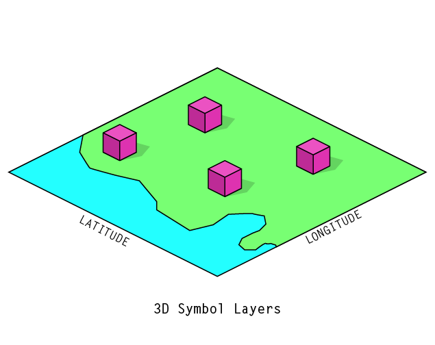
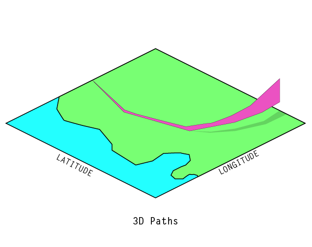
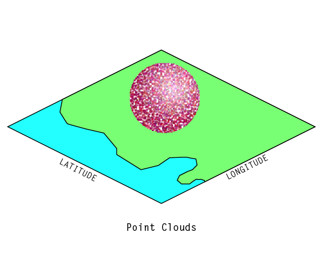
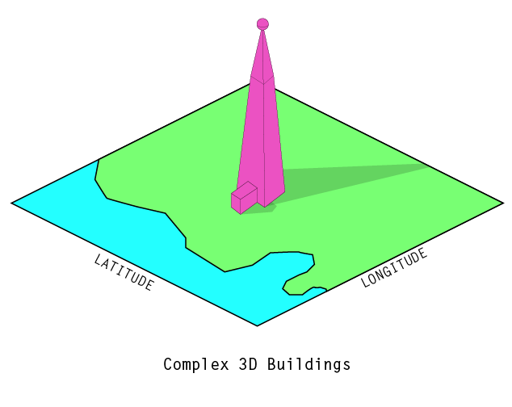
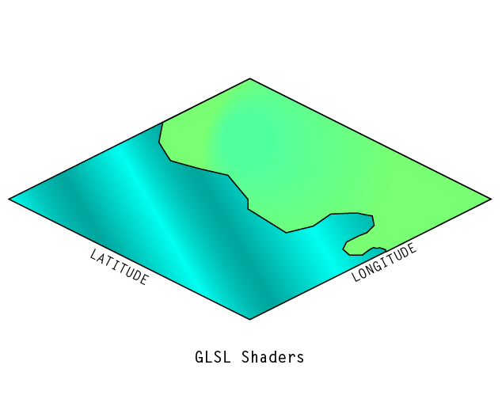
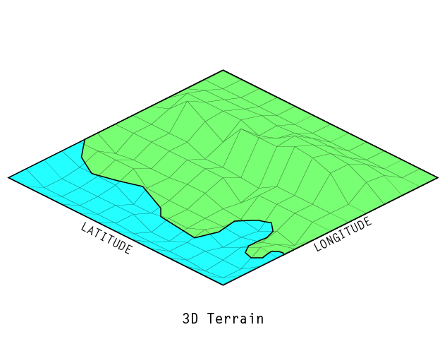

# threebox

A three.js plugin for Mapbox GL JS, with support for basic animation and advanced 3D rendering.

## Features
### Current
These features currently have a dedicated interface in `threebox`.
- 

### Planned
These features should be possible to implement using Three.js today but would benefit from a more geographic/map-specific interface in a future version of `threebox`.
- 
- 
- 
- 
- 

## Usage

### `var scene = new threebox(map);`

Instantiates a threebox canvas atop the Mapbox GL canvas object

- `map` Mapbox GL JS map object

### [`SymbolLayer3D`](/docs/SymbolLayer3D.md)

The `SymbolLayer3D` object lets you load in a GeoJSON `FeatureCollection` of points and will automically place 3D models at each point. For usage, see the [documentation](/docs/SymbolLayer3D.md).

### `var object = scene.addObject(position, mesh);`
Add object to the threebox scene.

- `position` `[longitude, latitude, elevation]` coordinates that define a point in space. Defaults to `[0,0,0]`.

- `mesh` A  three.js [mesh object](https://threejs.org/docs/?q=mesh#Reference/Objects/Mesh), typically consisting of a geometry and a material.

### `scene.removeObject(object);`

Removes object from the scene.

### `object.set(state, options);`

Move object to a new position and orientation. No animation by default.

- `state` an object detailing the new position/rotation to assume. Two keys:
	- `position` (optional) `[longitude, latitude, elevation]` coordinates that define a point in space. If not defined, position remains unchanged.

	- `rotation` (optional) `[rotationX, rotationY, rotationZ]` around the three axes. If not defined, rotation remains unchanged.

- `options`
	- `duration` time to animate this movement linearly, in seconds.

### `object.followPath(coordinates, options);`

- `coordinates` a series of `[longitude, latitude, elevation]` coordinates that describe a line path.
- `options` optional
	- `speed` speed of travel along this path, in meters per second.

## Building

`npm run build`

or to continually rebuild as you develop:

`npm run dev`
